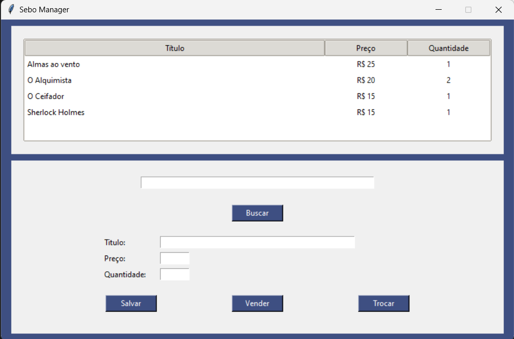
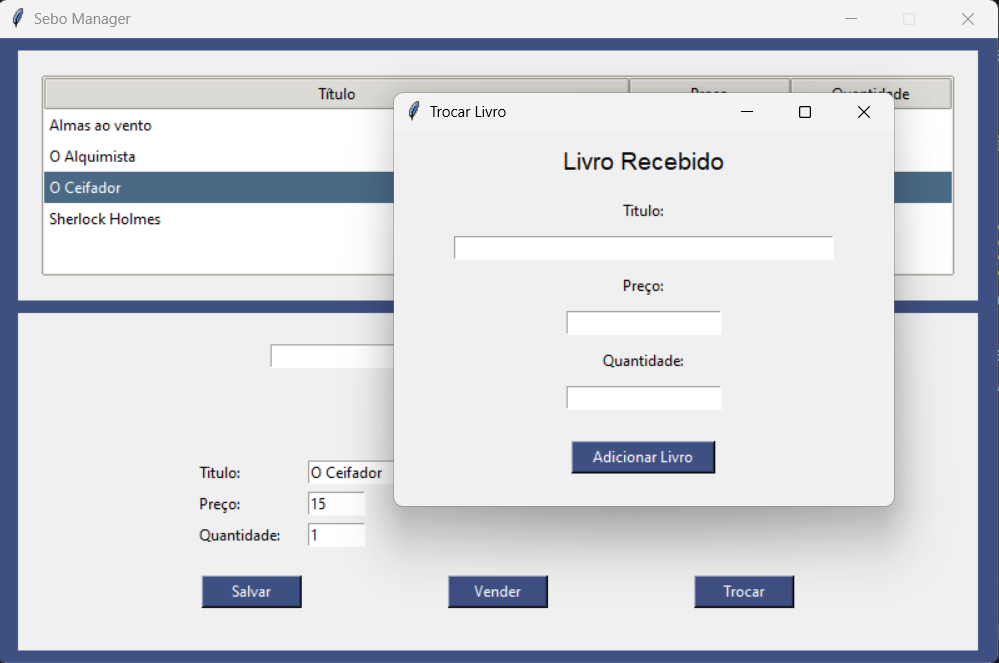
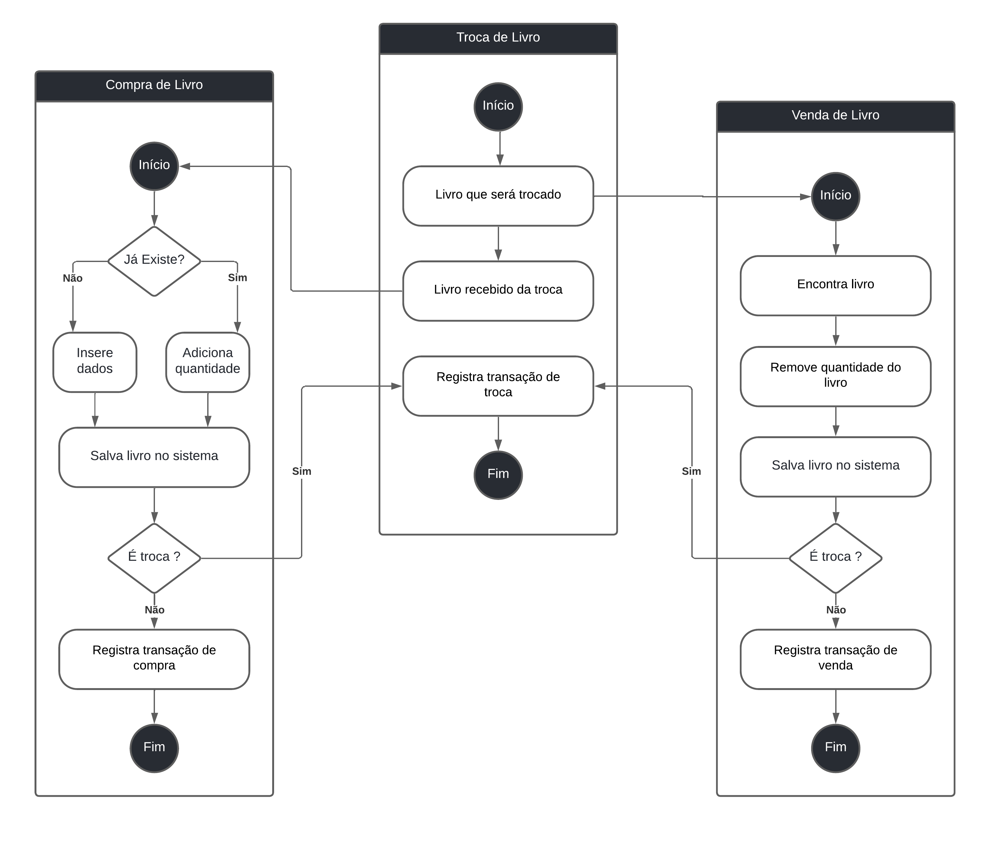

# Sebo Literário (GUI)

# Sobre o projeto

Este projeto foi desenvolvido como parte de um trabalho de extensão universitária que visa impactar a comunidade e comércio local através dos conhecimentos adquiridos em curso. 
O alvo deste projeto foi um sebo literário que utilizava-se de métodos manuais para seu gerenciamento, o que limitava sua eficiência operacional. 
O sistema desenvolvido simplifica significativamente esse processo ao automatizar tarefas e fornecer acesso simplificado às informações essenciais. Aqui é contido o esqueleto da interface que 
será aplicado neste projeto.

# Interface

# Ação de Troca

 
# Diagrama de Atividades

# Tecnologias utilizadas
- Python 3.12.3
- Tkinter

# Autor

Lucas Campos

https://www.linkedin.com/in/lucascamposdev/

